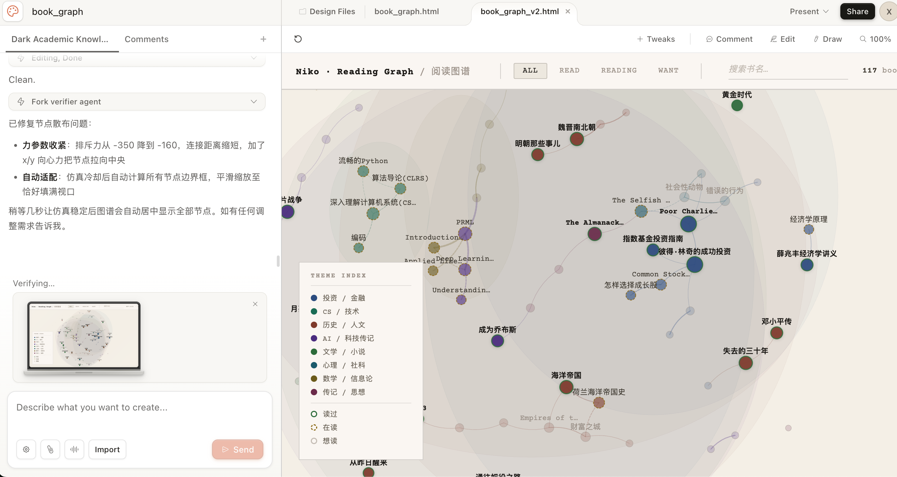
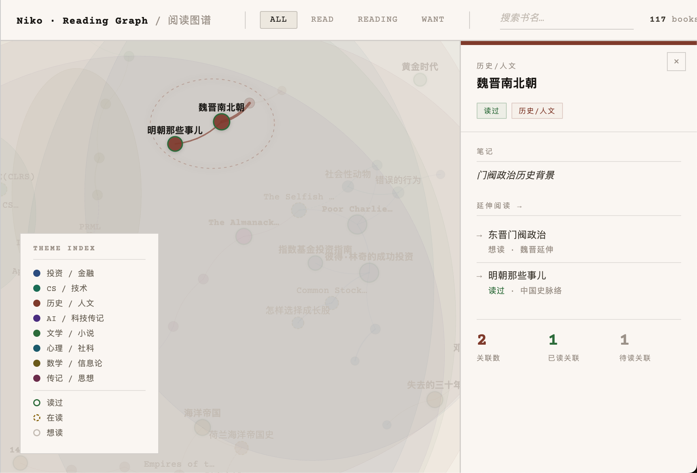
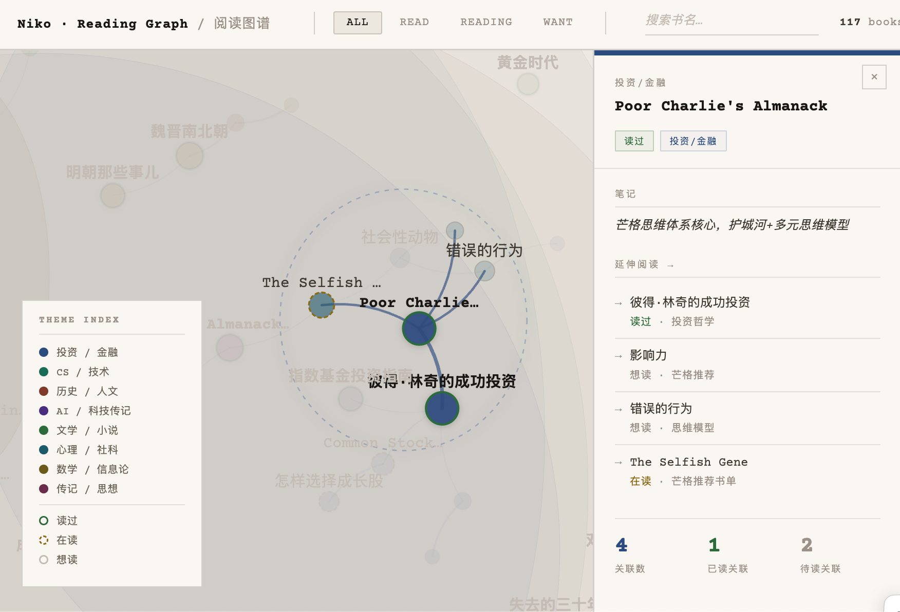

# Palimpsest / 忘筌

[中文介绍](docs/README.zh.md)

> 愿你得鱼而忘筌；得意而忘言。

Palimpsest / 忘筌 is a local-first personal reading intelligence system. The goal is not only to record books, but to turn reading into searchable, connected, reusable, and actionable knowledge assets.

```text
                 ·
          ·              ·

              ><(((º>

       water without water
       trace without capture
```

Product thesis:

```text
Not "I have read many books."
Instead: "I can let what I have read return when a project, question, or decision needs it."
```

## Why This Exists

The first user need is personal reading leverage:

- Capture reading history from Douban without losing source evidence.
- Verify that imported books were completely and correctly recorded.
- Enrich books with metadata from online book databases.
- Build explainable connections between books, notes, concepts, and projects.
- Create a graph/card interface that helps recall and reuse reading.
- Eventually support `Ask My Library`: answering questions from the user's own books, notes, highlights, and graph.

This is a personal-first project. The first success criterion is whether it improves the creator's own ability to harness reading.

## Current Design Exploration

The initial UI direction was explored in Claude Design with `book_graph_v2.html`. The preferred direction is a clean paper-like reading graph with typewriter-inspired typography, D3 network layout, search/filter controls, a theme legend, and a right-side book card.

Planned screenshots:







## Technical Stack

Planned MVP stack:

- Frontend: React + TypeScript + Vite.
- Backend: FastAPI.
- Database: SQLite first, with a Postgres migration path.
- Graph rendering: D3 inside a bounded React component.
- Metadata providers: Open Library and Google Books behind backend provider adapters.
- Agent workflow: Codex GPT-5.5 for planning/review and opencode + MiMo for implementation packets.

Current scaffold:

- `apps/api`: FastAPI app with a health endpoint.
- `apps/web`: React/Vite app shell.
- `SPEC.md`: product and architecture source of truth.
- `IMPLEMENTATION_PLAN.md`: milestone execution plan.
- `AGENT_PROTOCOL.md`: planning/implementation agent handoff protocol.
- `TASKS.md`: current backlog and task packets.

## Architecture Principle

Keep the system low-coupling:

```text
web -> api -> services -> repositories -> database
                 |
                 -> importers
                 -> metadata providers
                 -> graph builders
                 -> agent tools
```

Forbidden shortcuts:

- Parser directly writing to the database.
- LLM directly writing durable records.
- Metadata provider deciding final library entries.
- React calling external book metadata APIs directly.
- Graph renderer depending on raw Douban text.

## Project Story

This project started from a Claude Design UI exploration for a personal reading graph. The broader development experiment is to combine:

- Claude Design for early UI exploration.
- MiMo's trillion-token plan through opencode for implementation work.
- Codex GPT-5.5 for planning, architecture review, task design, and verification.
- A software-development workflow with specs, task packets, TDD, git discipline, and agent handoff protocols.

The practical product goal is to use Douban reading history as the first data source and build a system that helps the user maximize the value of what they have read.

## Development

API:

```bash
cd apps/api
.venv/bin/python -m uvicorn app.main:app --reload
```

Web:

```bash
cd apps/web
npm run dev
```

Checks:

```bash
cd apps/api
.venv/bin/python -m pytest
```

```bash
cd apps/web
npm run build
```

## Documentation

- [SPEC.md](SPEC.md): product thesis, architecture, data model, APIs, and long-term leverage model.
- [IMPLEMENTATION_PLAN.md](IMPLEMENTATION_PLAN.md): milestone plan.
- [AGENT_PROTOCOL.md](AGENT_PROTOCOL.md): multi-agent collaboration agreement.
- [TASKS.md](TASKS.md): current task backlog.
- [GIT_CONVENTIONS.md](GIT_CONVENTIONS.md): branch, commit, PR, and repo hygiene conventions.

## Status

Early planning and scaffold phase.
